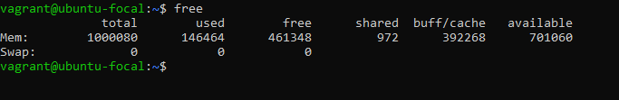
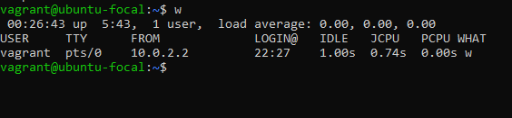
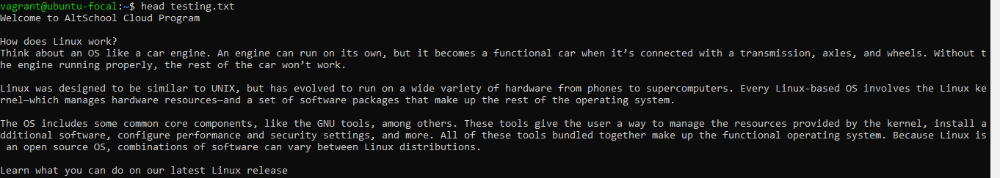
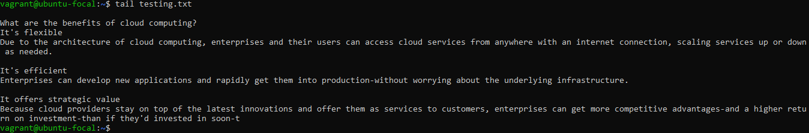
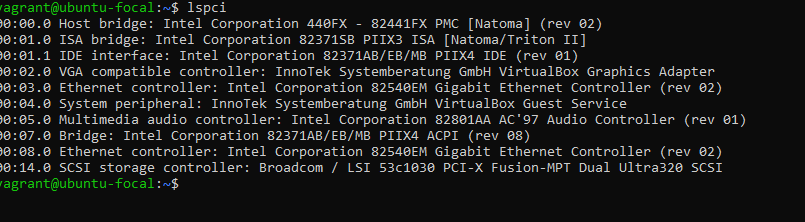
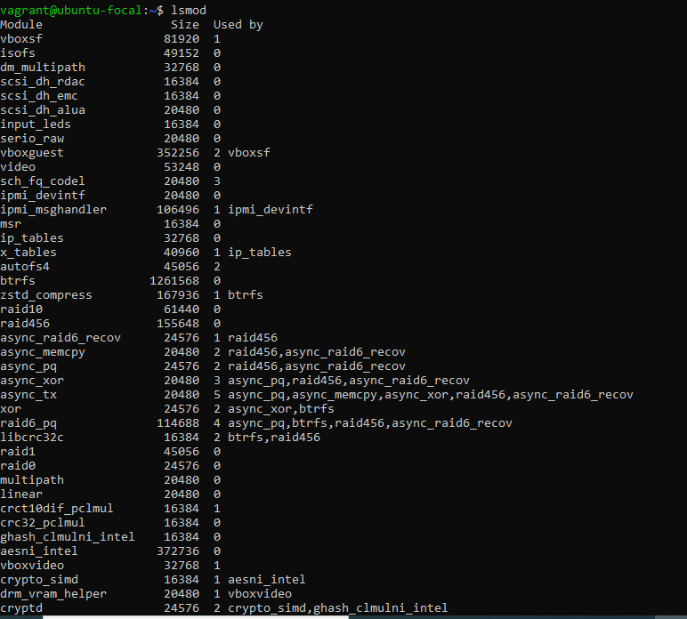

# 10 linux Commands And Their Functions

1. >`ip a `  
    Show IP address of default gateway   
    

2. >`cal`  
    Show this month's calendar
    

3. >`free `  
   Show memory and swap usage
   

4. >`w`  
   display who is online
   

5. >`more file`  
    Output the contents of file
    

6. >`head file`  
    Output the first 10 lines of file
    

7. >`tail file`  
    output the last 10 lines of file
    

8. >`tail -f file`  
    Output the contents of file as it grows, starting with the last 10 lines
    

9. >`lspci`  
    See general informatiion about host bridge, VGA controller, ethernet controller, USB controller, SATA controller, etc.
    

10. >`lsmod`  
    Find what modules are currently loaded 
    
   