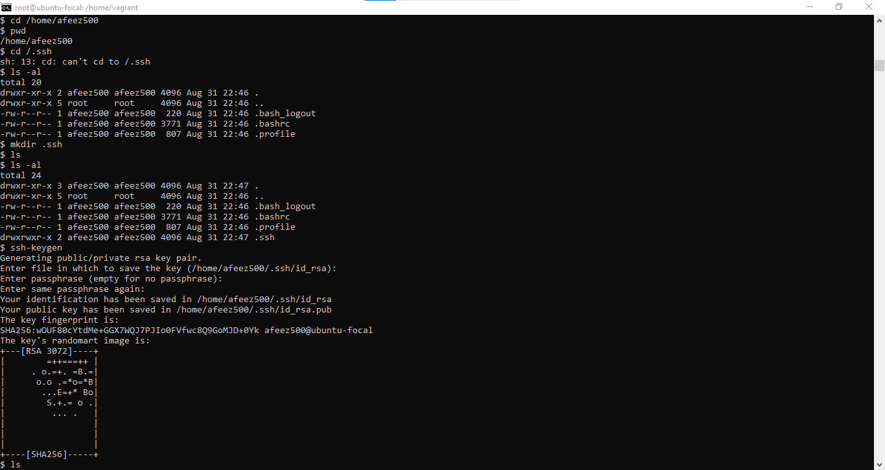

# Exercise 3
## 1.  Created 3 Groups (admin, support, Engineering)
The 3 groups were created with the command line *groupadd [group name]* , as shown in the image below;

## 2. Created a user in each group
A user name `afeez500`, `afeez501`, and `afeez502` was added to the admin, support and engineering group respectively as shown in the image below;

## 3. An ssh key was generated for the user in the admin group
The user in the admin group _afeez500_ was granted the sudo permission and hence was able to create a file in which the ssh key can be generated in as shown below; 

