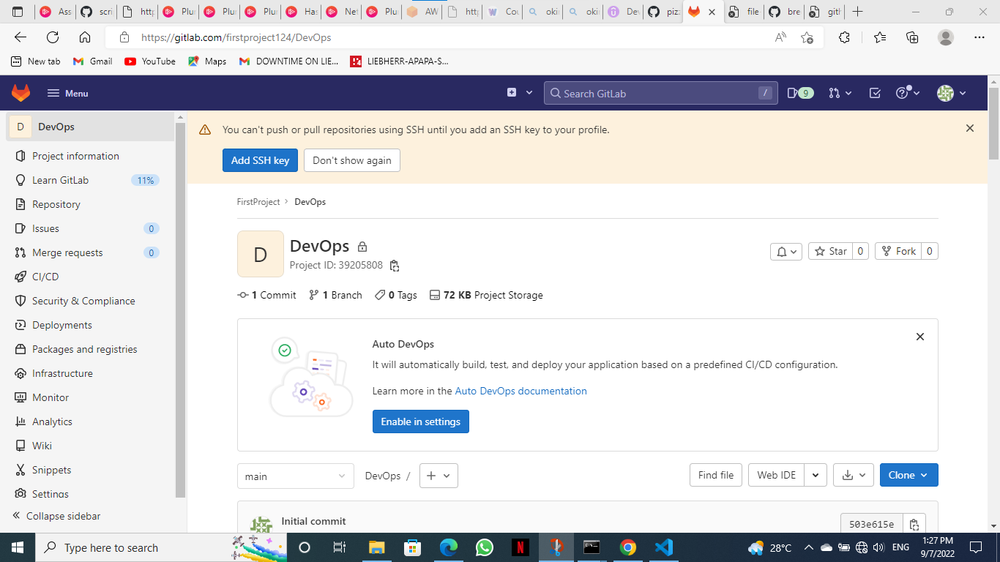

## Verification of Gitlab 
---
The image below verify the succesful sign up on gitlab




## Basic Git Commands
---

The `git config -l` shows the configuration of your git account in your local system;
```sh
    git config -l
```


The `git remote -v` list the remote connections you have to other respositories;
```sh
    git remote -v
```


The `git log` shows all commits in the current branch's history;
```sh
    git log
```

