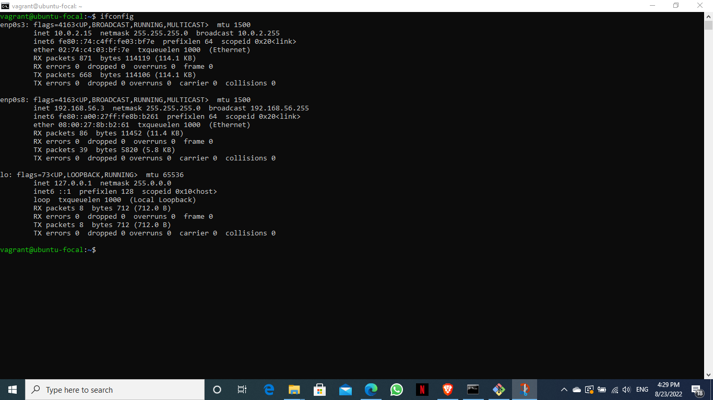

# Project1: Setup Ubuntu on your local machine using vagrant
***

## Prerequisite
***
Oracle VM
 
### In this project, we'll;
1. Customize the vagrant file as necessary with private_network set to DHCP as seen in this vagrant file [vagrantfile](vagrantfile)
    )
2. Once the machine is up, run ifconfig to display the list of ip addresses.
   

