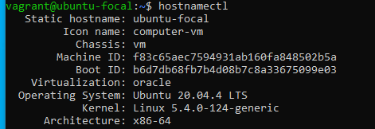

# PROJECT 7
 CREATE A BASH SCRIPT TO RUN AT EVERY HOUR, SAVING SYSTEM MEMORY (RAM) USAGE TO A SPECIFIED FILE AND AT MIDNIGHT IT SENDS THE CONTENT OF THE FILE TO A SPECIFIED EMAIL ADDRESS, THEN STARTS OVER FOR THE NEW DAY. 

### STEP 1
Create a mailtrap account as our dummy email


## STEP 2
Install the `ssmtp` and `mailutils` package with the commands below respestively;
```sh
        # sudo apt install ssmtp -y
         # sudo apt install mailutils -y
```
## STEP 3
Configure the ssmtp file 
#### Steps
* Execute the command below to access the ssmtp config file
```sh
        # sudo nano /etc/ssmtp/ssmtp.conf
```
* Replace the `root` with any email of your choice `mailhub` should be replaced with the host from the mailtrap account and the port number `465`
  
* Add the User, Password, UseTLS, UseSTARTTLS from the mailtrap account settings to the config file as shown below;

*NOTE*: Set the hostname if the root mail is that of the host name as shown below;
 
* Confirm if the mail setup is correct by sending a mail with an attachment (optional) from the server to the mailtrap account with the command shown below;
```sh
    # echo "Hello Afeez, Kindly find attached a list of the top 6 EPL team in England" | mail -s "EPL TEAMS" -A /home/vagrant/epl_teams.txt az@example.com
```
  

## STEP 4
* Create a directory and a file containing the script with the following commands below;
```sh
   # mkdir logs
   # cd logs
   # vi ram_log.sh
```
* Then copy the script below;
```sh
#!/bin/bash

# log file path

LOGFILE=/home/vagrant/logs/ram.log

#Email recipient
EMAIL="support@ubuntu-focal"

#Format Date
TIME=$(date +%H%M)

# Create log
function createLog() {
        if i -f $LOGFILE; then
                 rm -rf $LOGILE
        else
                touch $LOGFILE
                date >> $LOGFILE
                free -h >> $LOGFILE
        fi
}

if [[ $TIME == 0812 ]]; then
        createLog
        echo "Hello Helpdesk, Please find attached the memory log for today" | mail -s "MEMORY LOG" -A $LOGFILE $EMAIL
fi
```
* Give execution permission to the file
```sh
   # chmod +x ./ram_log.sh
```
*NOTE*: Set the timezone of the ubuntu machine to your timezone

## STEP 5
* Install cron on the ubuntu;
```sh
  # sudo install cron
```
* Edit the cron file by executing the command below;
```sh
  # crontab -e
```
* Add the following to the last line of the file to schedule the script;
```sh
  # 0 0 */1 * * bash /home/vagrant/logs/ram_log.sh
```
